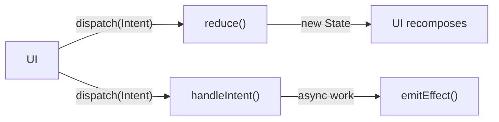

# Pulse : A minimal Kotlin Multiplatform MVI library

A Kotlin Multiplatform MVI (Model-View-Intent) library. Minimal API surface, zero boilerplate, full coroutine integration.

Pulse separates UI state management into predictable, testable layers: a pure reducer for synchronous state transitions, an intent handler for async side-effects, and one-shot effects for transient events like navigation or toasts.

## Modules

| Module             | Description                                   | Targets                         |
|--------------------|-----------------------------------------------|---------------------------------|
| `pulse`            | Core MVI container. Pure Kotlin + coroutines. | JVM, Android, iOS, JS, WasmJS   |
| `pulse-viewmodel`  | AndroidX ViewModel integration.               | JVM, Android, iOS, JS, WasmJS   |
| `pulse-savedstate` | Auto-persist state via SavedStateHandle.      | JVM, Android, iOS, JS, WasmJS   |
| `pulse-compose`    | Compose Multiplatform extensions.             | JVM, Android, iOS, JS, WasmJS   |
| `pulse-test`       | Test utilities with synchronous dispatch.     | JVM, Android, iOS, JS, WasmJS   |

### Dependency graph

```
pulse-compose     --> pulse
pulse-viewmodel   --> pulse
pulse-savedstate  --> pulse-viewmodel --> pulse
pulse-test        --> pulse
```

`pulse` has a single dependency: `kotlinx-coroutines-core`.

## Installation

Add the repository (in `settings.gradle.kts` or your repositories block):

```kotlin
repositories {
    maven("https://maven.bitsycore.com/releases")
}
```

Artifacts are also published to [GitHub Packages](https://github.com/bitsycore/pulse-mvi/packages)
as a fallback. Note that GitHub Packages requires authentication, even for public packages:

```kotlin
repositories {
    maven("https://maven.pkg.github.com/bitsycore/pulse-mvi") {
        credentials {
            username = providers.gradleProperty("gpr.user").orNull ?: System.getenv("GITHUB_ACTOR")
            password = providers.gradleProperty("gpr.token").orNull ?: System.getenv("GITHUB_TOKEN")
        }
    }
}
```

Then add the modules you need to your `build.gradle.kts`:

```kotlin
kotlin {
    sourceSets {
        commonMain.dependencies {
            implementation("com.bitsycore.lib:pulse:<version>")
            implementation("com.bitsycore.lib:pulse-viewmodel:<version>")
            implementation("com.bitsycore.lib:pulse-compose:<version>")
            implementation("com.bitsycore.lib:pulse-savedstate:<version>")
        }
        commonTest.dependencies {
            implementation("com.bitsycore.lib:pulse-test:<version>")
        }
    }
}
```

## Quick start

### 1. Define the contract

A contract declares the state, intents, and effects for a screen. It is the single source of truth.

```kotlin
object CounterContract : ContainerContract<CounterContract.UiState, CounterContract.Intent, CounterContract.Effect>() {

    data class UiState(
        val count: Int = 0,
    )

    sealed interface Intent {
        data object Increment : Intent
        data object Decrement : Intent
        data object Reset : Intent
    }

    sealed interface Effect {
        data class ShowToast(val message: String) : Effect
    }
}
```

### 2. Implement the ViewModel

The ViewModel holds the container, defines state reductions, and handles side-effects.

```kotlin
class CounterViewModel : PulseViewModel<UiState, Intent, Effect>(
    containerContract = CounterContract,
    initialState = UiState()
) {

    override fun reduce(state: UiState, intent: Intent): UiState = when (intent) {
        Intent.Increment -> state.copy(count = state.count + 1)
        Intent.Decrement -> state.copy(count = state.count - 1)
        Intent.Reset     -> state.copy(count = 0)
    }

    override suspend fun handleIntent(intent: Intent) {
        when (intent) {
            Intent.Reset -> emitEffect(Effect.ShowToast("Counter reset"))
            else -> {}
        }
    }
}
```

### 3. Connect the UI (Compose)

```kotlin
@Composable
fun CounterScreen(viewModel: CounterViewModel = viewModel { CounterViewModel() }) {
    val state by viewModel.collectAsStateWithLifecycle()

    viewModel.collectEffect { effect ->
        when (effect) {
            is Effect.ShowToast -> { /* show snackbar */ }
        }
    }

    CounterContent(state, viewModel::dispatch)
}
```

## Core concepts

### Container

`Container` is the MVI engine. It receives intents, runs them through a pure reducer for state transitions, then launches an async handler for side-effects.



- `reduce(state, intent)` -- Pure, synchronous. Returns the next state. No side-effects.
- `handleIntent(intent)` -- Suspend function for async work (network, database, etc.).
- `emitEffect(effect)` -- Emits a one-shot event (navigation, toasts, etc.). Effects are buffered but not replayed to late collectors.
- `updateState { copy(...) }` -- Convenience for modifying state outside the reducer (e.g., inside callbacks).

### DebouncedDispatcher

Standalone debounce engine for rate-limiting rapid input. Not embedded in `Container` — create one and wire it to any dispatch function.

- `dispatchDebounced(intent, delay)` -- Dispatches after a debounce window. Configurable debounce key, skip-if-unchanged, and cross-type sharing.
- `cancel(key)` -- Cancels a pending debounce by key and clears its dispatch history.
- `cancelAll()` -- Cancels all pending debounces and clears all dispatch history.
- `clearHistory()` -- Resets the `skipIfUnchanged` history without cancelling pending debounces.

### ContainerContract

Groups the three MVI types into a single object. Does not hold state — `initialState` is provided by the ViewModel.

```kotlin
object MyContract : ContainerContract<MyState, MyIntent, MyEffect>()
```

### ContainerHost

Interface exposing the public API of a container:

```kotlin
interface ContainerHost<STATE, INTENT, EFFECT> {
    val stateFlow: StateFlow<STATE>
    val effectFlow: Flow<EFFECT>
    fun dispatch(intent: INTENT)
}
```

### Effects

Effects are emitted via `emitEffect()` and delivered through a `SharedFlow`. They are fire-and-forget one-shot events — each effect is delivered to active collectors only. Effects are not replayed to late subscribers. Use `collectEffect` or `collectEffectWithLifecycle` in Compose to handle them.

## ViewModel integration

### PulseViewModel

Wraps `Container` in an AndroidX `ViewModel`. The container's coroutine scope is tied to `viewModelScope`.

```kotlin
class MyViewModel : PulseViewModel<MyState, MyIntent, MyEffect>(
    containerContract = MyContract,
    initialState = MyState()
) {
    override fun reduce(state: MyState, intent: MyIntent): MyState = ...
    override suspend fun handleIntent(intent: MyIntent) { ... }
}
```

### PulseSavedStateViewModel

Extends `PulseViewModel` with automatic state persistence via `SavedStateHandle`. State is serialized to JSON on every change and restored on creation. Requires `STATE` to be `@Serializable`.

```kotlin
@Serializable
data class UiState(val count: Int = 0)

class MyViewModel(savedStateHandle: SavedStateHandle) :
    PulseSavedStateViewModel<UiState, Intent, Effect>(
        containerContract = MyContract,
        initialState = UiState(),
        savedStateHandle = savedStateHandle,
        serializer = UiState.serializer()
    ) {
    override fun reduce(state: UiState, intent: Intent): UiState = ...
}
```

In Compose:

```kotlin
val viewModel: MyViewModel = viewModel { MyViewModel(createSavedStateHandle()) }
```

State survives process death and backstack eviction as long as the `SavedStateHandle` is alive.

## Compose extensions

### collectAsStateWithLifecycle

Lifecycle-aware state collection. Defaults to `Lifecycle.State.STARTED`.

```kotlin
val state by viewModel.collectAsStateWithLifecycle()
```

### collectEffect

Lifecycle-aware one-shot effect collector.

```kotlin
viewModel.collectEffect { effect ->
    when (effect) {
        is Effect.Navigate -> navigator.navigate(effect.route)
        is Effect.ShowToast -> snackbarHostState.showSnackbar(effect.message)
    }
}
```

### onLifecycleIntent

Maps Android lifecycle events to intents. Dispatch lifecycle-driven logic without leaking lifecycle awareness into the ViewModel.

```kotlin
viewModel.onLifecycleIntent {
    onCreate  { Intent.OnCreated }
    onStart   { Intent.OnStarted }
    onResume  { Intent.OnResumed }
    onPause   { Intent.OnPaused }
    onStop    { Intent.OnStopped }
    onDestroy { Intent.OnDestroyed }
}
```

### onCompositionIntent

Maps Compose composition enter/exit events to intents.

```kotlin
viewModel.onCompositionIntent {
    onEnter { Intent.OnScreenEntered }
    onExit  { Intent.OnScreenExited }
}
```

## ComponentContract

A lightweight sub-container for complex nested state. Has its own reducer but no effects or async handling. Useful for reusable UI components (color pickers, form fields, etc.) that can be embedded in a parent screen's state.

```kotlin
object ColorPickerComponent : ComponentContract<ColorPickerComponent.State, ColorPickerComponent.Intent>() {

    override val initialState = State()

    @Serializable
    data class State(
        val red: Float = 0f,
        val green: Float = 0f,
        val blue: Float = 0f,
    )

    sealed interface Intent {
        data class SetRed(val value: Float) : Intent
        data class SetGreen(val value: Float) : Intent
        data class SetBlue(val value: Float) : Intent
    }

    override fun reduce(state: State, intent: Intent): State = when (intent) {
        is Intent.SetRed   -> state.copy(red = intent.value.coerceIn(0f, 1f))
        is Intent.SetGreen -> state.copy(green = intent.value.coerceIn(0f, 1f))
        is Intent.SetBlue  -> state.copy(blue = intent.value.coerceIn(0f, 1f))
    }
}
```

Embed in a parent contract:

```kotlin
object PageContract : ContainerContract<PageContract.UiState, PageContract.Intent, PageContract.Effect>() {

    data class UiState(
        val title: String = "",
        val colorPicker: ColorPickerComponent.State = ColorPickerComponent.initialState,
    )

    sealed interface Intent {
        data class ColorPicker(val intent: ColorPickerComponent.Intent) : Intent
    }
}
```

Delegate in the ViewModel reducer:

```kotlin
override fun reduce(state: UiState, intent: Intent): UiState = when (intent) {
    is Intent.ColorPicker -> state.copy(
        colorPicker = ColorPickerComponent.reduce(state.colorPicker, intent.intent)
    )
}
```

## Debouncing

`DebouncedDispatcher` is a standalone debounce engine. Create one and wire it to any dispatch function — typically inside a ViewModel.

### Setup

```kotlin
class SearchViewModel : PulseViewModel<UiState, Intent, Effect>(
    containerContract = SearchContract,
    initialState = UiState()
) {

    private val debouncer = DebouncedDispatcher(viewModelScope, ::dispatch)

    fun dispatchDebounced(intent: Intent, delay: Duration) =
        debouncer.dispatchDebounced(intent, delay)

    fun cancelDebounce(key: String) = debouncer.cancel(key)

    override fun reduce(state: UiState, intent: Intent) = when (intent) {
        is Intent.UpdateQuery -> state.copy(query = intent.query)
        is Intent.Search -> state
    }

    override suspend fun handleIntent(intent: Intent) {
        if (intent is Intent.Search) {
            val results = api.search(intent.query)
            updateState { copy(results = results) }
        }
    }
}
```

### Usage in Compose

```kotlin
TextField(
    value = state.query,
    onValueChange = { query ->
        dispatch(Intent.UpdateQuery(query))                                   // immediate UI update
        viewModel.dispatchDebounced(Intent.Search(query), 300.milliseconds)   // debounced API call
    }
)
```

### Debounce options

```kotlin
// Basic: debounce by intent type (default key)
debouncer.dispatchDebounced(Intent.Search(query), delay = 300.milliseconds)

// Custom key: independent debounce per field
debouncer.dispatchDebounced(Intent.UpdateName(name), delay = 300.milliseconds, key = "name")
debouncer.dispatchDebounced(Intent.UpdateEmail(email), delay = 300.milliseconds, key = "email")

// Skip unchanged: drop duplicate intents
debouncer.dispatchDebounced(Intent.Search(query), delay = 300.milliseconds, skipIfUnchanged = true)

// Share across types: different intent types cancel each other
debouncer.dispatchDebounced(Intent.Search(query), delay = 300.milliseconds, shareAcrossTypes = true)
```

### Cancellation and history

```kotlin
// Cancel a specific debounce key (e.g., user cleared the search field)
debouncer.cancel("search")

// Cancel all pending debounces and reset history
debouncer.cancelAll()

// Reset skipIfUnchanged history without cancelling pending debounces
debouncer.clearHistory()
```

## Testing

`pulse-test` provides a synchronous test container and assertion utilities.

### Basic test

```kotlin
@Test
fun incrementUpdatesCount() = CounterContract.containerTest(
    initialState = CounterContract.UiState(),
    reduce = { state, intent ->
        when (intent) {
            Intent.Increment -> state.copy(count = state.count + 1)
            Intent.Decrement -> state.copy(count = state.count - 1)
            Intent.Reset -> state.copy(count = 0)
        }
    }
) {
    dispatch(Intent.Increment)
    assertState { it.count == 1 }

    dispatch(Intent.Increment)
    dispatch(Intent.Increment)
    assertState(UiState(count = 3))
}
```

### Testing effects

```kotlin
@Test
fun resetEmitsToast() = CounterContract.containerTest(
    initialState = CounterContract.UiState(),
    handleIntent = { intent ->
        when (intent) {
            Intent.Reset -> emitEffect(Effect.ShowToast("Counter reset"))
            else -> {}
        }
    }
) {
    val effect = awaitEffect {
        dispatch(Intent.Reset)
    }
    assertEquals(Effect.ShowToast("Counter reset"), effect)
}
```

### Collecting multiple effects

```kotlin
@Test
fun multipleEffects() = runTest {
    val container = TestContainer(
        contract = CounterContract,
        initialState = CounterContract.UiState(),
        testScope = this,
        intentHandler = { intent ->
            when (intent) {
                Intent.Increment -> emitEffect(Effect.ShowToast("inc"))
                Intent.Reset -> emitEffect(Effect.ShowToast("reset"))
                else -> {}
            }
        }
    )

    val effects = container.collectEffects(this) {
        container.dispatch(Intent.Increment)
        container.dispatch(Intent.Reset)
    }

    assertEquals(2, effects.size)
}
```

### Testing ComponentContract

ComponentContract has a pure reducer with no async behavior. Test it directly.

```kotlin
@Test
fun colorPickerClampsValues() {
    val state = ColorPickerComponent.reduce(
        ColorPickerComponent.initialState,
        ColorPickerComponent.Intent.SetRed(1.5f)
    )
    assertEquals(1f, state.red)
}
```

## Build

```bash
./gradlew build                    # Build all modules
./gradlew :pulse:build             # Build core only
./gradlew :pulse-test:jvmTest      # Run tests
./gradlew :demo:run                # Run desktop demo app
```

## License

[MIT](LICENSE.md)
